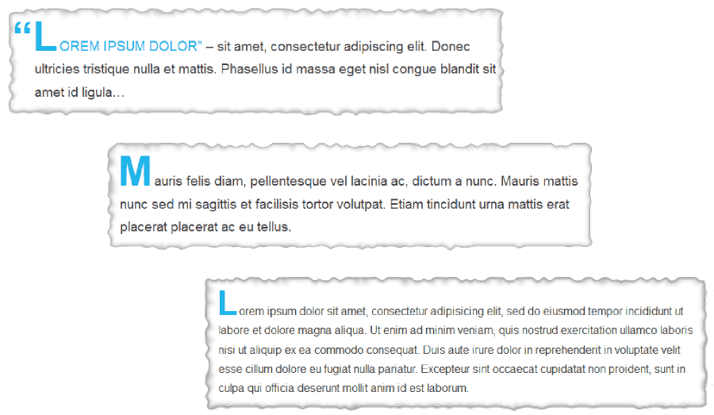

# [Grav DropCaps Plugin][project]

> This plugin places a decorative dropped initial capital letter to the start of the first paragraph of a text.

## About

DropCaps are used for the first letter of a paragraph and generally used once on the page. It is a very old technique, pre-dating the invention of movable type, and they indicate to the reader that a new section of text has begun.

DropCaps can be created using CSS only (with the `:first-letter` pseudo-attribute), which is supported by all major Internet browsers. However, if the first paragraph starts with an opening quote followed by a letter, it will style the quote and not the first letter as a drop-cap. This plugin circumvent this by adding mark-up to your posts and pages which allows you to create wicked drop-caps like this



Further it allows you to replace the first letter of user-specified paragraphs with an image of a letter and to capitalize the first x characters of a paragraph (breaking on word boundaries or optionally punctuation).

## Installation and Updates

Installing or updating the `DropCaps` plugin can be done in one of two ways. Using the GPM (Grav Package Manager) installation method (i.e. `bin/gpm install dropcaps`) or manual install or update method by downloading [this plugin](https://github.com/sommerregen/grav-plugin-dropcaps) and extracting all plugin files to

	/your/site/grav/user/plugins/dropcaps

For more informations, please check the [Installation and update guide](INSTALL.md).

## Usage

The `DropCaps` plugin comes with some sensible default configuration, that are pretty self explanatory:

### Config Defaults

```
# Global plugin configurations

enabled: true                 # Set to false to disable this plugin completely
built_in_css: true            # Use built-in CSS of the plugin
weight: -5                    # Set the weight (order of execution)

# Global and page specific configurations

process: true                 # Toggle to process drop-caps on the page or not
titling:
  enabled: false              # Toggle to (de-)activate titling of text
  first_line: false           # Highlight first line of paragraph
  breakpoints: ".,!?'\"-"     # Specify which characters will end titling
```

If you need to change any value, then the best process is to copy the [dropcaps.yaml](dropcaps.yaml) file into your `users/config/plugins/` folder (create it if it doesn't exist), and then modify there. This will override the default settings.

If you want to alter the settings for one or a few pages only, you can do so by adding page specific configurations into your page headers, e.g.

```
dropcaps:
  titling:
    enabled: true
    first_line: true
```

to highlight the first line of paragraph instead of only the first sentence.

### CSS Stylesheet Override

Something you might want to do is to override the look and feel of the drop-caps, and with Grav it is super easy.

Copy the stylesheet [css/dropcaps.css](css/dropcaps.css) into the `css` folder of your custom theme, and add it to the list of CSS files.

```
/your/site/grav/user/themes/custom-theme/css/dropcaps.css
```

After that set the `built_in_css` option of the `DropCaps` plugin to `false`. That's it.

You can now edit, override and tweak the stylesheet however you prefer. You can style the whole drop-cap using the class `.dropcaps`. If you prefer styling individual drop-caps, just add styles to the class `.dropcaps-x`, where *x* denotes the lowercased letter you are interested in.

## Contributing

You can contribute at any time! Before opening any issue, please search for existing issues and review the [guidelines for contributing](CONTRIBUTING.md).

After that please note:

* If you find a bug or would like to make a feature request or suggest an improvement, [please open a new issue][issues]. If you have any interesting ideas for additions to the syntax please do suggest them as well!
* Feature requests are more likely to get attention if you include a clearly described use case.
* If you wish to submit a pull request, please make again sure that your request match the [guidelines for contributing](CONTRIBUTING.md) and that you keep track of adding unit tests for any new or changed functionality.

### Support and donations

If you like my project, feel free to support me via [][flattr] or by sending me some bitcoins to **1HQdy5aBzNKNvqspiLvcmzigCq7doGfLM4**.

Thanks!

## License

Copyright (c) 2015 [Benjamin Regler][github]. See also the list of [contributors] who participated in this project.

[Licensed](LICENSE) for use under the terms of the [MIT license][mit-license].

[github]: https://github.com/sommerregen/ "GitHub account from Benjamin Regler"
[mit-license]: http://www.opensource.org/licenses/mit-license.php "MIT license"

[flattr]: https://flattr.com/submit/auto?user_id=Sommerregen&url=https://github.com/sommerregen/grav-plugin-dropcaps "Flatter my GitHub project"

[project]: https://github.com/sommerregen/grav-plugin-dropcaps
[issues]: https://github.com/sommerregen/grav-plugin-dropcaps/issues "GitHub Issues for Grav DropCaps Plugin"
[contributors]: https://github.com/sommerregen/grav-plugin-dropcaps/graphs/contributors "List of contributors of the project"
